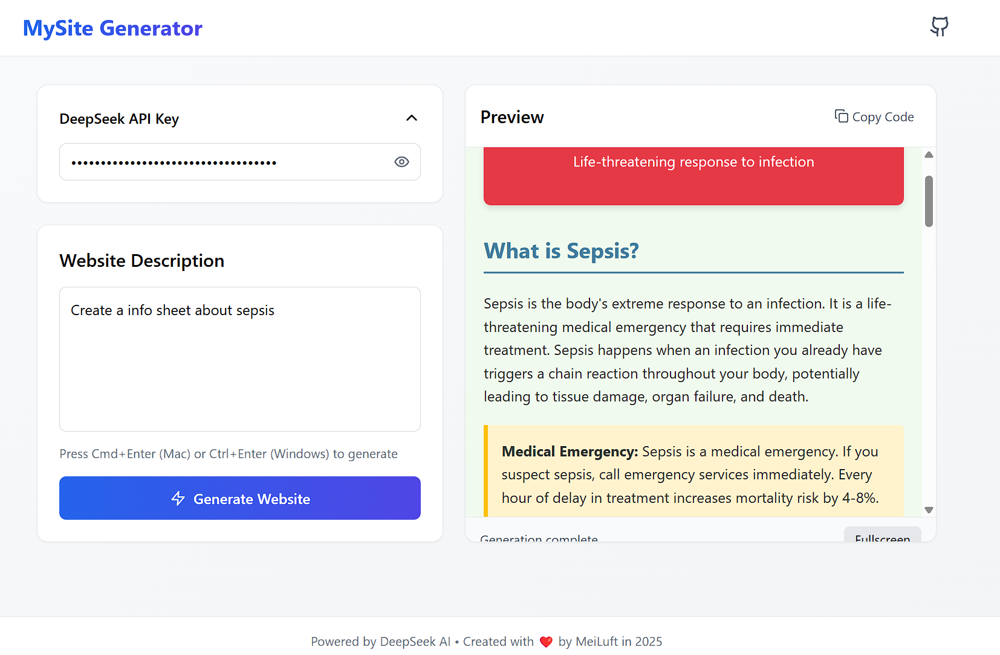

# MyDeepSite Generator

A React-based web application for generating and previewing HTML websites in real-time.



## Features

- Real-time HTML generation
- Interactive preview window
- Fullscreen preview mode
- Clean, modern UI with TailwindCSS
- Responsive design

## Technologies Used

- React 18
- TypeScript
- Vite
- TailwindCSS
- Lucide React (icons)

## Getting Started

### Prerequisites

- Node.js (v18+ recommended)
- npm (v9+ recommended)

### Installation

1. Clone the repository
2. Install dependencies:
   ```bash
   npm install
   ```
3. Start the development server:
   ```bash
   npm run dev
   ```

## Project Structure

```
src/
├── components/       # React components
│   ├── Generator.tsx
│   ├── Preview.tsx
│   ├── PromptInput.tsx
│   └── APIKeyInput.tsx
├── hooks/            # Custom hooks
│   └── useAutoComplete.ts
├── services/         # API services
│   └── api.ts
├── utils/            # Utility functions
│   └── delay.ts
├── App.tsx           # Main application
├── main.tsx          # Entry point
└── index.css         # Global styles
```

## Available Scripts

- `npm run dev`: Starts the development server
- `npm run build`: Builds the app for production
- `npm run preview`: Previews the production build
- `npm run lint`: Runs ESLint

## Contributing

1. Fork the project
2. Create your feature branch (`git checkout -b feature/AmazingFeature`)
3. Commit your changes (`git commit -m 'Add some amazing feature'`)
4. Push to the branch (`git push origin feature/AmazingFeature`)
5. Open a Pull Request

## License

Distributed under the MIT License. See `LICENSE` for more information.
